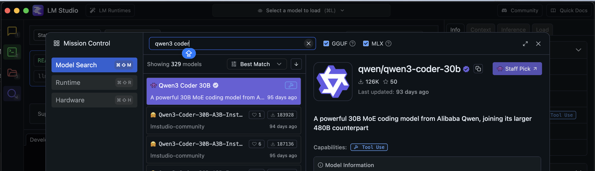

# LM Studio Setup Guide

Wetware Studio works great with LM Studio for local AI inference. This guide will help you set up LM Studio with the recommended model.

## Why LM Studio?

- ✅ **100% Local** - No API keys needed, runs entirely on your machine
- ✅ **Privacy** - Your code never leaves your computer
- ✅ **No Cost** - No API usage fees
- ✅ **Powerful** - Run models like Qwen3 Coder 30B locally

## Recommended Model

**Qwen3 Coder 30B** - A powerful 30B MoE (Mixture of Experts) coding model from Alibaba Qwen, designed specifically for code generation and understanding.

## Installation Steps

### 1. Download LM Studio

Download and install LM Studio from [lmstudio.ai](https://lmstudio.ai/)

### 2. Search for Qwen3 Coder 30B

1. **Open LM Studio**
2. **Click the Search icon** (magnifying glass) in the left sidebar
3. **Type** `qwen3 coder` in the search box
4. **Look for**: `qwen/qwen3-coder-30b`



### 3. Download the Model

1. **Click** on `qwen/qwen3-coder-30b` from the search results
2. **Select a quantization**:
   - **Recommended**: `Qwen3-Coder-30B-A3B-Inst...` (GGUF format)
   - Choose based on your available RAM (126K or 187K variants)
3. **Click Download**
4. Wait for download to complete (model is ~18-20GB)

### 4. Load the Model

1. **Go to** "LM Runtime" tab in the left sidebar
2. **Click** "Select a model to load"
3. **Choose** `qwen/qwen3-coder-30b` from your downloaded models
4. **Click** "Load Model"
5. Wait for the model to load into memory

### 5. Start the Local Server

1. LM Studio automatically starts a local API server at `http://127.0.0.1:1234`
2. The server is **OpenAI-compatible**, so Wetware Studio can use it directly

### 6. Configure Wetware Studio

1. **Open** your `.env.local` file in Wetware Studio
2. **Add** the following:

```bash
# LM Studio Configuration
LMSTUDIO_API_BASE_URL=http://127.0.0.1:1234
```

3. **Save** the file
4. **Restart** Wetware Studio (`pnpm dev`)

### 7. Select the Model in Wetware Studio

1. **Open** Wetware Studio in your browser
2. **Click** the model selector dropdown
3. **Select** "LMStudio" as the provider
4. **Choose** `qwen/qwen3-coder-30b` from the model list

## Troubleshooting

### Model Not Loading
- **Check RAM**: Qwen3 Coder 30B requires at least 32GB RAM (16GB+ available)
- **Try smaller quantization**: If model fails to load, try a more compressed variant

### Connection Failed
- **Verify LM Studio is running**: Check the "LM Runtime" tab shows the model as loaded
- **Check port**: Make sure nothing else is using port 1234
- **Restart LM Studio**: Sometimes a restart helps

### Slow Performance
- **Enable Metal/CUDA**: Check LM Studio settings for GPU acceleration
- **Reduce context length**: Lower the context window in LM Studio settings
- **Close other apps**: Free up RAM and GPU resources

## Alternative Models

If Qwen3 Coder 30B doesn't work for you, try these alternatives:

- **DeepSeek Coder 33B** - Great for code generation
- **CodeLlama 34B** - Meta's coding model
- **Qwen2.5 Coder 7B** - Smaller, faster option for lower-end hardware

## Benefits of Local AI

- **No Rate Limits** - Generate as much code as you want
- **Offline Support** - Works without internet connection
- **Data Privacy** - Your code stays on your machine
- **Cost Savings** - No API usage fees

## Performance Tips

1. **Use GPU Acceleration**: Enable Metal (Mac) or CUDA (Nvidia) in LM Studio
2. **Allocate Enough RAM**: Close other applications to free memory
3. **Adjust Context Length**: Balance between capability and performance
4. **Monitor Resource Usage**: Keep an eye on CPU/GPU/RAM in Activity Monitor

## Questions?

If you encounter issues, check:
- [LM Studio Discord](https://discord.gg/lmstudio)
- [Wetware Studio Issues](https://github.com/MyrmtolioDebroudon/wetware-studio/issues)
